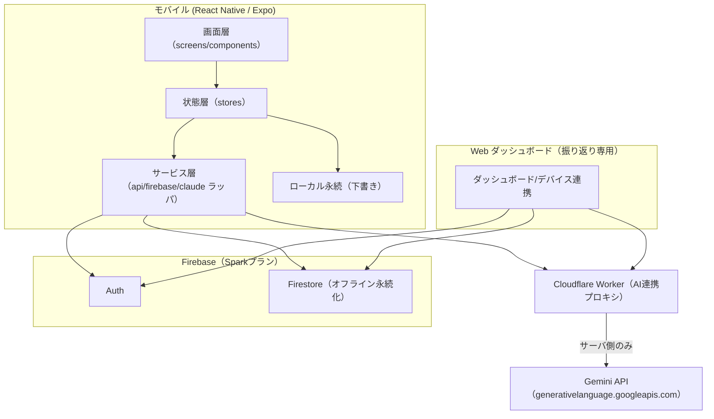
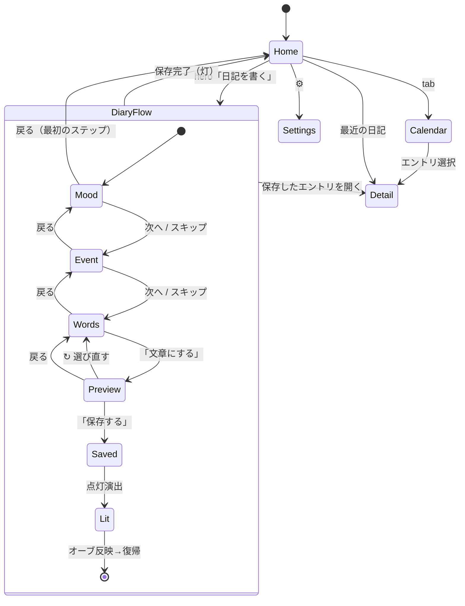
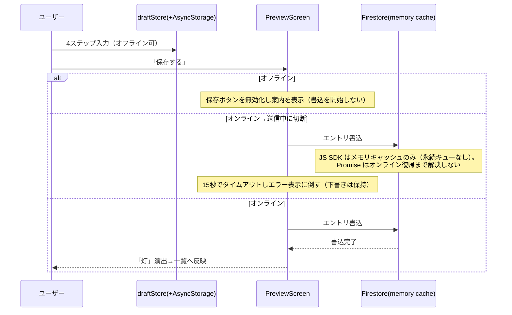

# たそがれ日記 詳細設計：アーキテクチャ（architecture.md）

> **位置づけ**: ステップ3（詳細設計）の中核。[docs/design/basic-design.md](design/basic-design.md) の全体方針を受けて、システム構成・ディレクトリ・ナビゲーション・状態管理・画面遷移・UIデザインシステム・「こころの灯」オーブのアニメーション仕様を確定水準で定義する。データ設計は [data.md](data.md)、API 仕様は [api-contract.md](api-contract.md)、画面別仕様は [screen.md](screen.md) に分離する（これら3ファイルはステップ3の後続タスクで作成する）。
> **一次情報**: UI（配色・タイポグラフィ・クラス名・画面遷移）は `visual-design.html` v1 を正とする。要件の正は Notion [たそがれ日記 要件定義書](https://app.notion.com/p/395cd5c5312e81b0b73fc2d95219b084)。
> **技術選定**: 要件に明記が無いものは「案A/案B＋推奨」で提示し断定しない（本プロジェクトの方針。[basic-design.md](design/basic-design.md) の一次情報の扱いに準拠）。

---

## 1. システム構成

### 1.1 全体構成


> **実装メモ（Phase2）**: Firebase Blaze プラン回避のため、AI 連携は Firebase Functions（Cloud Functions）ではなく **Cloudflare Workers**（`worker/`）で実装している。Firebase は Auth/Firestore のみ（Spark プラン）。また、当初 Anthropic（Claude）を想定していたが、無料運用のため **Google Gemini API** に変更した（`worker/src/llm/`。プロバイダ抽象化済みで別 API へ移管容易）。詳細は [environments.md](../.claude/rules/environments.md)、[api-contract.md](api-contract.md)、[worker/README.md](../worker/README.md)。

### 1.2 レイヤ責務（モバイル）
| レイヤ | 責務 | 主なもの |
|---|---|---|
| 画面層 | 表示・入力・遷移 | `screens/`, `components/` |
| 状態層 | 画面横断の状態・下書き・楽観更新 | `stores/`（下書き、認証、設定、日記キャッシュ） |
| サービス層 | 外部I/Oの抽象化 | `services/firebase`, `services/claudeWorker`, `services/diary` |
| ローカル永続 | オフライン下書き | 下書きストア（後述） |

> **原則**: 画面層は AI API / Firestore を直接触らず、必ずサービス層を経由する。AI API はサーバ側プロキシ（Cloudflare Worker）経由のみ（`constraints.md`）。

---

## 2. ディレクトリ構成（src/、案）

```
src/
├── app/                # ルート・ナビゲーション定義
│   ├── navigation/     # Stack / Tab の構成
│   └── providers/      # Auth/Theme/QueryClient 等のProvider
├── screens/            # 画面（1画面=1ディレクトリ）
│   ├── home/
│   ├── diary/          # mood / event / words / preview（4ステップ）
│   ├── calendar/
│   ├── detail/         # 詳細＋AI対話
│   └── settings/        # Web連携QR・バックアップ・アカウント削除
├── components/         # 再利用UI（Orb, Pebble, StepProgress, NoteCard 等）
├── stores/             # 状態（draft, auth, settings, entries）
├── services/           # firebase / functions / diary / pairing
├── theme/              # デザイントークン（配色・タイポ・spacing）
├── hooks/              # 汎用フック
├── types/              # 型定義
└── utils/              # 汎用ユーティリティ
```

> Web ダッシュボードは別ディレクトリ／別アプリで管理する（第6章の実装方式に依存）。共有したい型・デザイントークンは切り出し方を第6章で決める。

---

## 3. ナビゲーション構成

### 3.1 構成（案・推奨）
- **ライブラリ（推奨）**: React Navigation（`native-stack` ＋ `bottom-tabs`）。RN/Expo で最も実績があり、型付きルートに対応。
  - 案B: Expo Router（ファイルベース）。将来 Web 共有を強めるなら選択肢。導入コストと引き換えに規約が固い。
- **構成**:
  - **Bottom Tabs**: ホーム / カレンダー（`visual-design.html` の `.tab-bar` に対応）。
  - **Stack（各タブ上）**: 詳細（detail）、設定（settings。Web連携QR・バックアップ・アカウント削除を1画面に統合）。
  - **日記作成フロー**: ホームから push する **モーダル/独立スタック**（mood → event → words → preview）。フロー中は Tab を隠す。

### 3.2 ルート定義（概念）
```
RootStack
├─ MainTabs
│   ├─ HomeStack ( Home → Detail )
│   └─ CalendarStack ( Calendar → Detail )
├─ DiaryFlow (modal) : Mood → Event → Words → Preview → (灯 演出)
└─ Settings : 設定（Web連携QR・バックアップ・アカウント削除を1画面に統合。screen.md 3.9）
```

> **画面ID対応**（`visual-design.html` の実装ID）: `Mood`=`mood1`（きもち）／`Event`=`event1`（できごと）／`Words`=`combine1`（ことば）／`Preview`=`create2`（たしかめる）。`src/screens/diary/{mood,event,words,preview}` はこの対応に従う。

### 3.3 画面遷移フロー（全体）


> **basic-design.md との対応**: 保存フローは `Preview → Saved →（点灯演出）Lit → Home/Detail` で [basic-design.md](design/basic-design.md) 第3.2節と一致させる（`Saved` は保存確定、`Lit` は保存後の点灯演出で専用入力画面を持たない）。
> **戻る操作**: 各ステップは1つ前へ戻れる（`.back-btn`）。最初のステップ（Mood）からの戻るはフローを離脱し Home へ。フロー離脱時は下書きを保持（第7章）。

---

## 4. 状態管理方針

### 4.1 方針（決定）
> **決定（2026-07-07）**: 下表の推奨（**Zustand ＋ TanStack Query**、下書きは永続化）を採用。永続化の実装は当面 **AsyncStorage**（開発ビルド移行時に MMKV へ差し替え可能。詳細は第4.3節）。

| 対象 | 採用 | 理由 |
|---|---|---|
| クライアント状態（下書き・UI） | **Zustand** | 軽量・ボイラープレート少・companion 体験の軽さに合致。案B: Redux Toolkit（規模拡大時の規律）／案C: Context+useReducer（最小だが横断状態に弱い） |
| サーバ状態（日記一覧・詳細） | **TanStack Query**（＋Firestore購読） | キャッシュ・再取得・楽観更新を標準化。オフライン時は Firestore 永続化に委譲 |

### 4.2 主なストア（Zustand 想定）
| ストア | 保持 | 備考 |
|---|---|---|
| `draftStore` | 進行中の日記（mood/event/words/生成文/感情ラベル） | オフライン継続の要。ローカル永続に同期 |
| `authStore` | 認証状態・uid | 差し替え可能な認証プロバイダ（下記）を利用 |
| `settingsStore` | 表示設定・reduced-motion 等 | アクセシビリティ反映 |
| `entriesCache` | 直近エントリ | TanStack Query と併用 |

**認証プロバイダの抽象（Phase2 Auth）**: 認証は `AuthProvider` インターフェース（`init`/`signIn`/`signOut`）で抽象化し、実装を差し替える。
- **ローカル匿名プロバイダ（既定）**: 端末に uid を発行・永続（AsyncStorage）。モバイルはログイン画面を持たず、uid を自動確立する（visual-design.html のとおり、サインインは「Webで見る」/バックアップ時のみ）。
- **Firebase プロバイダ**: `EXPO_PUBLIC_FIREBASE_*` 設定を検出したら切り替える。**当面は配布しない**前提のため既定は **匿名認証（Firebase Auth Anonymous、JS SDK）** ＝ 開発ビルド不要・Expo Go 可で実 uid を確立する。uid は Firestore（entries/messages）のスコープに用いる。設定プロバイダ失敗時（例: 初回起動オフライン）は authStore がローカル匿名へフォールバックする。**将来、任意のタイミングでアプリ配布も考慮**しており、その際は恒久アカウント（Webで見る/バックアップ）向けに Apple/Google サインインを匿名アカウントへ **リンク昇格** する。**この昇格ロジック・ネイティブ資格情報取得はともに実装済み**（`firebaseAuthProvider.linkWith`＝`linkWithCredential`／`authStore.linkAccount`／設定画面（`SettingsScreen`）の導線／エラーは `AuthLinkError` へ写像／`nativeCredentialSource.ts`＝Apple・Google 資格情報取得の中核＝ネイティブ非依存で単体テスト可能／`nativeCredentialSourceInstall.ts`＝実モジュール（`expo-apple-authentication`＋`expo-crypto`／`@react-native-google-signin`）束ね＋`installNativeCredentialSource()`）。資格情報は `OAuthCredentialSource` シーム（`src/services/auth/credentialSource.ts`）越しに `setCredentialSource` で差し込む。**有効化には開発ビルドが必要**（ネイティブモジュール要）。起動エントリでの呼び出しは**配線済み**（`index.ts` → `nativeAuthBootstrap` の `bootstrapNativeCredentialSource()`。`.env` の `EXPO_PUBLIC_ENABLE_NATIVE_AUTH=1` のときだけ `installNativeCredentialSource()` を動的 require して呼ぶ）。bootstrap はネイティブモジュールを静的 import しないので App.tsx／Expo Go 既定バンドルへ引き込まず、フラグ未設定の Expo Go では `canLinkAccount` false で導線非表示。**`EXPO_PUBLIC_USE_NATIVE_FIREBASE=1`（ネイティブFirebase移行フラグ）有効時は、上記の代わりに `nativeFirebaseAuthProvider.linkWith` が使われる**（同じ `nativeCredentialSource.ts`/`OAuthCredentialSource` シーム経由で資格情報を取得し、`@react-native-firebase/auth` の `linkWithCredential` へ橋渡しする。詳細は [migration-react-native-firebase.md](migration-react-native-firebase.md) フェーズ5）。
- **Web版（Expo Web でモバイルアプリ自体をブラウザ表示した場合）の連携ゲート（実装済み）**: ネイティブは起動時に自動で匿名セッションを発行するが、Web版では同じ挙動だと「ブラウザだけの新規（空）アカウント」が毎回でき、スマホの日記と食い違ってしまう。そのため `authStore` に `'needs-connect'` ステータスを追加し、`Platform.OS === 'web'` かつ Firebase 設定済みで既存セッションが無い場合のみ、自動サインインを止めて連携ゲート（`src/screens/webConnect/WebConnectGate.tsx`）を表示する（`App.tsx`が`RootNavigator`の代わりに描画。`AppProviders`＝`SafeAreaProvider`配下で描画する必要がある。未配下だと`SafeAreaView`がクラッシュする＝実機確認で発見）。ゲートは4通りの導線を持つ: ①QRカメラ読取（`QrCameraScanner.tsx`。`getUserMedia`+`jsQR`。RNには`<video>/<canvas>`が無いため`View`のrefから実DOMノードを取得し要素を直接生成する）②コード貼り付け（`extractPairingToken`/`signInWithPairingToken`＝`src/services/pairing.ts`に追加。Worker の`/verifyPairingToken`を`requireAuth:false`で呼び`signInWithCustomToken`）③Googleサインイン（`signInWithGoogleWeb`＝`src/services/auth/webOAuth.ts`。`signInWithPopup`、Expo Webは実ブラウザのため利用可）④「サインインせずに利用する」（`signInAnonymously`。あとから設定画面で連携できる）。設定画面（`SettingsScreen`のWeb版分岐）には`WebAccountRow`を追加し、匿名セッションなら「スマホと連携する」（`authStore.requestWebConnect()`でサインアウト+ゲートへ戻す）、非匿名（連携済み）なら「ログアウトする」を表示する（`user.isAnonymous`で判定。`AuthUser`型に`isAnonymous`を追加）。ユーザー指摘により追加（当初この機能を別プロジェクトの`web/`ダッシュボードへ実装したが、対象はモバイルアプリ自体のExpo Webビルドだったと判明し作り直した）。

### 4.3 下書き（オフライン）永続
- **実装済み**: MMKV はネイティブモジュールのため Expo Go では動かず、開発ビルド未導入の現段階では **案B（`AsyncStorage`、`services/storage.ts`）を採用**。`draftStore`（`src/stores/draftStore.ts`）を zustand の `persist` ミドルウェアで永続化し、アプリ再起動・強制終了後も下書き（mood/event/words/生成文/感情ラベル）が復元される。起動時のハイドレーション完了は `hasHydrated` フラグで管理し、`App.tsx` の起動ゲート（フォント/認証初期化と同様）で待ち合わせることで、復元前の入力が永続データで上書きされる競合を防止している。開発ビルド移行時は `KeyValueStorage` インターフェースを維持したまま MMKV アダプタへ差し替え可能。
- 確定エントリは Firestore に保存し、オフライン永続化で復帰時同期（[constraints.md](../.claude/rules/constraints.md)）。

---

## 5. UIデザインシステム（`visual-design.html` を正）

### 5.1 カラートークン（CSS変数 → theme）
| 用途 | トークン | 値 |
|---|---|---|
| 背景（紙） | `paper` / `paperSoft` | `#F1EFEE` / `#FBFAF8` |
| 文字（墨） | `ink` / `inkSoft` / `inkFaint` | `#302E3A` / `#726F7C` / `#ACA9B2` |
| たそがれ（主アクセント） | `dusk` / `duskDeep` / `duskSoft` | `#8C6F8C` / `#6F5670` / `#EFE7EE` |
| 感情：穏やか | `calm` / `calmSoft` | `#7FA48F` / `#E6EDE8` |
| 感情：やや疲れ | `tender` / `tenderSoft` | `#C0975A` / `#F2E9D8` |
| 感情：しんどい | `heavy` / `heavySoft` | `#B27E7E` / `#F1E2E1` |
| 境界線 | `line` | `#E5E1DD` |

> 感情3色はオーブ・カレンダー・バッジで共通。`theme/colors.ts` に集約し、ハードコード禁止。

### 5.2 タイポグラフィ
| 役割 | フォント |
|---|---|
| 見出し・日記本文 | `Klee One`（fallback: Hiragino Mincho ProN, serif） |
| UI | `Zen Maru Gothic`（fallback: Hiragino Sans, sans-serif） |

- Expo では `expo-font` / `expo-google-fonts` で読み込む。日記本文は必ず display フォントを用いる（`visual-design.html` の `.diary-full-text` / `.note-card`）。

### 5.3 主要コンポーネント（クラス→RN）
| コンポーネント | 由来クラス | 用途 |
|---|---|---|
| `Orb` | `.orb` | 呼吸するオーブ（第8章） |
| `OrbMini` | `.orb-mini` | 一覧・カレンダー・バッジの小オーブ |
| `Pebble` | `.pebble`（-a/-b/-c 形） | 候補・選択チップ。`-a/-b/-c` は有機的な角丸の3バリエーションで、`visual-design.html` では順に交互配置。選択時は `.pebble.on` 相当のスタイル |
| `StepProgress` | `.step-progress` / `.step-dot` | 4ステップ進捗ドット |
| `NoteCard` | `.note-card` / `.note-tape` | 生成文プレビュー |
| `PrimaryButton` | `.primary-btn` | 主アクション |
| `MoodBadge` | `.mood-badge` | 感情ラベル表示 |

---

## 6. Web ダッシュボード実装方式（案）

分析UIはモバイルに載せず Web 限定（`visual-design.html` `.dash-note`）。

| 案 | 内容 | 長所 | 短所 |
|---|---|---|---|
| **案A（推奨）** | **Next.js（React）別アプリ ＋ Firebase Hosting** | Web 特化UIを最適化、SSR/ルーティング成熟、同一 Firebase を参照 | コードベースが分離、型・トークンの共有に工夫要 |
| 案B | Expo Web で単一コードベース | RN コンポーネント共有 | ダッシュボードの表現力・レスポンシブに制約、バンドル肥大 |
| 案C | 軽量SPA（Vite+React）＋ Firebase Hosting | 軽い | エコシステム/規約が案A比で弱い |

- **共有戦略（案A採用時）**: `packages/shared`（型・デザイントークン・Firestore スキーマ型）を切り出し、モバイル/Web で参照（モノレポ or npm ワークスペース）。
- 認証はモバイルの QR ペアリング（api-contract.md 予定）＋ Apple/Google サインイン。

> **決定（2026-07-07、U-04）**: **案A（Next.js 別アプリ＋Firebase Hosting）を採用**。型・デザイントークンは `shared` パッケージで共有する。

> **実装メモ（Phase4・実装済み）**: `web/`（Next.js App Router・別 npm プロジェクト）に実装。**静的エクスポート（`output: 'export'`）**で Firebase Hosting 配信を前提とする（SSR 不要・閲覧専用）。共有は**リポジトリ直下 `shared/`**（`shared/theme/tokens.ts`＝配色・感情トークン／`shared/types/insight.ts`＝週次/月次まとめ型）に切り出し、モバイル（`src/theme/colors.ts` は再エクスポートに変更）と Web（`@shared/*` エイリアス）の双方が参照する。日記エントリ型（`src/types/diary.ts`）は現状モバイル独自定義のままで、Web が日記本文を扱う段階（別タスク）で `shared/types` へ移す。ルート：`/connect`（デバイス連携）・`/pair?token=…`（QR ディープリンク着地→照合→`signInWithCustomToken`）・`/dashboard`（感情推移・よく使う言葉・AIまとめ）。まとめは Worker の `generateInsight` から取得（本文は LLM へ送らない）。`/entries`（日記本文の閲覧・Firestore 直読）・Firebase Hosting デプロイ設定（`firebase.json`/`.firebaserc`）・カメラでの QR ライブ読取（`/connect`）・`/entries` の検索/無限スクロール・Apple/Google サインイン代替導線（`/connect`・`web/src/lib/oauth.ts` の `signInWithPopup`）・ダッシュボードの「過去3ヶ月」タブ（`generateInsight` の `type: 'quarterly'`＝末尾月を含む直近3ヶ月・`worker/src/insight.ts`）も実装済み。**モバイル側の匿名→Apple/Google リンク昇格ロジック・ネイティブ資格情報取得（Apple/Google サインインUI＝`nativeCredentialSource.ts`／`installNativeCredentialSource`）もともに実装済み**（`src/services/auth`）。後者の有効化は開発ビルド前提（ネイティブモジュール要・Expo Go では未適用で導線非表示。[web/README.md](../web/README.md)）。`web/` はルートの lint/型/テスト対象外（各設定で除外）。

---

## 7. オフライン・同期アーキテクチャ


- 入力途中はネット不要（`draftStore`）。Claude を要する処理（連想・生成・対話・まとめ）はネット必須で、オフライン時は明示（`constraints.md`）。
- **データ永続はリポジトリ層で抽象化**（`services/repository`）。Firebase 未設定時はローカル（AsyncStorage）、設定時は Firestore（`users/{uid}/entries`）に切り替わる。
- **Firestore のオフライン永続（RN 制約）**: Firebase JS SDK は RN で IndexedDB を使えず**メモリキャッシュ中心**（`experimentalForceLongPolling` を有効化）。永続化されたローカルキューを持たないため、**オフライン中に発行した書込 Promise はオンライン復帰までハングする**（アプリの生存中はメモリ上の書込は再送されるが、プロセスが終了すれば失われる）。`constraints.md` が求める本格的なオフライン永続は、必要になった段階で **`@react-native-firebase`（ネイティブ）** への移行で対応する（残タスク。移行計画は [migration-react-native-firebase.md](migration-react-native-firebase.md) に設計済み＝未着手。Firestoreのみでなく Auth も対象になる理由・既存匿名ユーザーの uid 継続方法まで含めて記載）。
  - **当面の緩和策（実装済み・`PreviewScreen`）**: 保存ボタンは `isOffline` 中は無効化し、書込を開始しない（ハング防止）。送信後にオフラインへ転じた場合に備え、書込を 15 秒でタイムアウトしエラー表示に倒す（`withTimeout`）。いずれの場合も `draftStore` の下書きは `reset()` を呼ぶ保存成功時（「灯」演出後）まで保持されるため、オフライン中でも下書きが失われることはなく、オンライン復帰後に再度「保存する」で再試行できる。

---

## 8. 「こころの灯」オーブ アニメーション仕様

### 8.1 呼吸（常時サイン）
`visual-design.html` の `@keyframes breathe` を正とする。

| 項目 | 値（正） |
|---|---|
| 変化 | `scale` 1.0 ↔ 1.055（中間 50%）|
| 周期 | 4.8s、`ease-in-out`、無限ループ |
| 塗り | `radial-gradient(circle at 32% 28%, #ffffffaa 0%, var(--calm) 0%, var(--tender) 55%, var(--dusk) 100%)`（ホーム大オーブ、`visual-design.html:89` 原文）|
| 実装 | `react-native-reanimated`（UIスレッド駆動、JS をブロックしない）|

> グラデーションの `calm`/`tender`/`dusk` は RN では `theme.colors` の同名トークンで参照する。原文では `#ffffffaa 0%` と `var(--calm) 0%` が同じ 0% 位置に置かれており（＝最初の白は実質ハイライトの起点）、実装時にグラデーションの意図を確認しつつ再現する。

- **感情別の小オーブ**: `radial-gradient(circle at 35% 30%, #fff8, <感情色>)`。感情色は calm/tender/heavy を適用。
- **reduced-motion**: `prefers-reduced-motion: reduce` 相当で呼吸を停止（`AccessibilityInfo.isReduceMotionEnabled`）。`visual-design.html` の `@media (prefers-reduced-motion:reduce){.orb{animation:none;}}` に対応。

### 8.2 灯る演出（保存後）
要件定義書 §4.1 の「灯（保存後の演出）」を可視化する。**新規仕様**（HTML にモック無し、詳細はここで定義）。

- **トリガ**: 「保存する」成功後。
- **表現（推奨）**: ホームの大オーブへ遷移しつつ、(1) 一瞬明度が上がる（グロー）→(2) 当日の感情色へ落ち着く→(3) 気づき一言を短くフェード表示。所要 ~1.2–1.6s、`ease-out`。
- **reduced-motion 時**: グローを省略し、感情色反映＋一言表示のみ（クロスフェード）。
- **配色**: グローは `duskSoft`〜白のハイライト、収束色は当日の感情色。
- 数値（イージング曲線・各フェーズ時間）は実装時に微調整可とし、`theme/motion.ts` に定数化。

### 8.3 その他アニメーション（`visual-design.html` 準拠）
| 要素 | 由来 | 挙動 |
|---|---|---|
| ビューファインダ（Web連携） | `@keyframes softPulse` | opacity 0.55↔1、2.6s |
| 読み取り待機ドット | `.pulse-dot` | softPulse 1.4s |
| 押下フィードバック | `.hero-zone:active` 等 | scale 0.96–0.97 |

いずれも reduced-motion で停止／簡略化する。

---

## 9. 要件・設計トレース
| 本章の項目 | 対応元 |
|---|---|
| システム構成・レイヤ | basic-design.md 第2章／Notion 要件定義書 §6 |
| 画面遷移（4ステップ→灯） | basic-design.md 第3章／Notion §4.1 |
| 状態管理・オフライン | basic-design.md 第4/7章／`constraints.md` |
| 配色・タイポ・コンポーネント | `visual-design.html`（CSS変数・クラス） |
| オーブ仕様 | `visual-design.html` `@keyframes breathe`／Notion §3・§4.1 |
| Web 実装方式 | basic-design.md 第2章／U-04 |

---

## 10. 次工程への申し送り・未確定
- **決定済（2026-07-07）**: Web 実装方式＝Next.js 別アプリ（第6章、U-04）、状態管理＝Zustand＋TanStack Query（第4章）、QR 認証＝短命回転トークン（U-08、api-contract.md 第5章）。詳細は Notion 要件定義書 §11。
- **data.md（作成済み）**: エントリ/ワード/感情/対話/ペアリング/インサイトの確定スキーマ、Firestore 構造とセキュリティルール、下書き↔同期の整合を反映済み。
- **screen.md（作成済み）**: 各画面のレイアウト・状態・遷移・空/エラー/ローディング表現、コンポーネント props を反映済み。
- **api-contract.md（作成済み）**: Claude 各用途の入出力、Functions エンドポイント、QR 発行/照合、モデル選定（U-12）を反映済み。
- **残作業**: オーブ 8.2 灯る演出の最終数値仕様は実機で調整（60fps 維持、実装フェーズで確定）。
