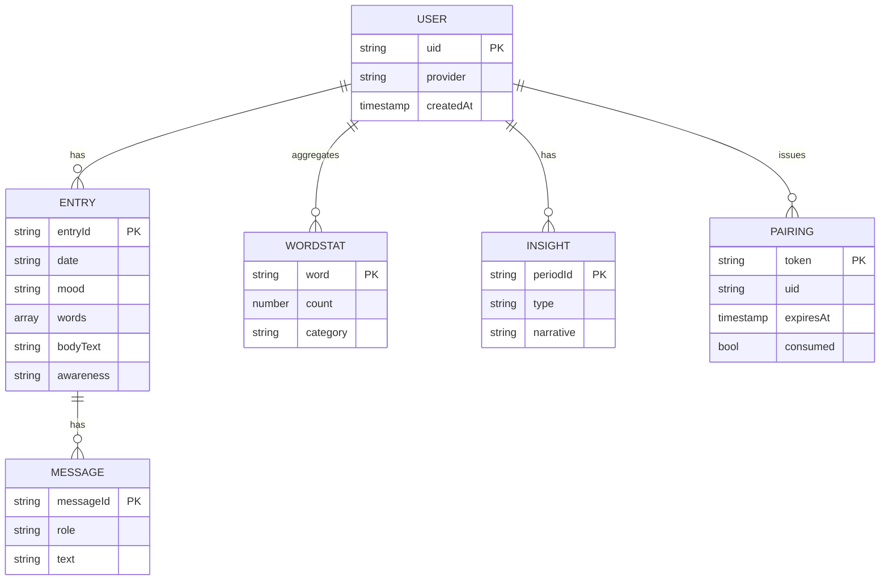

# たそがれ日記 詳細設計：データ設計（data.md）

> **位置づけ**: ステップ3（詳細設計）。[architecture.md](architecture.md) のシステム構成を前提に、Firestore のコレクション設計・スキーマ・関係・インデックス・セキュリティルール・オフライン同期・削除方針を確定水準で定義する。API 仕様は [api-contract.md](api-contract.md)、画面別仕様は [screen.md](screen.md)（`api-contract.md`・`screen.md` はステップ3の後続タスクで作成予定）。
> **要件の正**: Notion [たそがれ日記 要件定義書](https://app.notion.com/p/395cd5c5312e81b0b73fc2d95219b084)。UI の正: `visual-design.html` v1。基本方針: [basic-design.md](design/basic-design.md) 第5章。
> **技術選定**: 要件に明記が無いものは「案A/案B＋推奨」で提示し断定しない。

---

## 1. データストア全体像

| ストア | 役割 | 備考 |
|---|---|---|
| **Firestore** | 確定データ（ユーザー・日記・ワード集計・対話・インサイト・ペアリング） | オフライン永続化を有効化。全データ uid スコープ |
| **ローカル下書き（AsyncStorage、実装済み）** | 4ステップ入力の途中状態 | Firestore に載せず端末内のみ。保存確定で Firestore へ。将来 MMKV へ差し替え可能な抽象（`services/storage.ts`）（[architecture.md](architecture.md) 第4.3/7章） |
| **Cloud Functions（サーバ）** | Claude 仲介・集計・QR 照合・削除 | Claude API キーはここだけが保持（[constraints.md](../.claude/rules/constraints.md)） |

> **原則**: 日記は極めてセンシティブ。全ドキュメントは本人（uid）のみアクセス可（第7章）。分析用の集計は最小限のフィールドに限定する。

---

## 2. コレクション構成

**方針（推奨）**: ユーザーごとにデータを分離するため、日記・ワード集計・対話・インサイトは **`users/{uid}` 配下のサブコレクション**に置く。QRペアリングのみ、Web からの照合が必要なため**トップレベル**に置く。

```
users/{uid}                         … ユーザー
  ├─ entries/{entryId}              … 日記エントリ（1日1件を基本）
  │    └─ messages/{messageId}      … AI対話（保存要否は U-05、既定=保存）
  ├─ wordStats/{word}               … よく使う言葉の集計（Web ダッシュボード用）
  └─ insights/{periodId}            … 週次/月次インサイト（生成キャッシュ）
pairings/{token}                    … QRペアリングの短命トークン（トップレベル）
```

> **代替案（不採用）**: 全エントリをトップレベル `entries/` に置き `uid` フィールドで絞る案（案B）。クエリは単純だがルールとインデックスが複雑化し、ユーザー削除時の一括操作もしにくいため、サブコレクション（案A）を推奨。

### 2.1 エンティティ関係


---

## 3. スキーマ定義

> 型は Firestore の論理型。`timestamp` はサーバタイムスタンプ、`date` は文字列 `YYYY-MM-DD`（端末ローカル日付、カレンダー突き合わせ用）。全ドキュメントに `schemaVersion:(number)` を持たせ将来のマイグレーションに備える。
>
> **実装メモ（Phase2）**: クライアント型（`entries`/`messages`）は現状 `schemaVersion` を持たない（未実装）。マイグレーションが必要になった時点で、クライアント型・`localXxxRepository`・`firestoreXxxRepository` に追加する。

### 3.1 `users/{uid}`
| フィールド | 型 | 必須 | 説明 |
|---|---|---|---|
| `uid` | string | ✓ | Auth の uid（ドキュメントID と一致） |
| `provider` | string | ✓ | `apple` / `google` |
| `displayName` | string |  | 任意 |
| `settings` | map |  | `{ reduceMotion: bool, ... }`（UIは端末側が正、サーバは補助） |
| `createdAt` | timestamp | ✓ | 作成 |
| `updatedAt` | timestamp | ✓ | 更新 |
| `schemaVersion` | number | ✓ | 例: 1 |

### 3.2 `users/{uid}/entries/{entryId}`
| フィールド | 型 | 必須 | 説明 |
|---|---|---|---|
| `date` | string(`YYYY-MM-DD`) | ✓ | 記録対象日。カレンダー/一覧のキー |
| `mood` | string enum |  | `calm`/`tender`/`heavy`（スキップ時 null）|
| `words` | array\<map\> | ✓ | 選択語群。要素: `{ text:string, category:"mood"\|"event"\|"assoc", source:"selected"\|"typed" }` |
| `bodyText` | string | ✓ | Claude 生成の日記本文（1段落） |
| `awareness` | string |  | 「灯」ステップの気づき一言（任意） |
| `adjustments` | array\<string\> |  | 適用した調整（`positive`/`shorter`/`detailed` 等）の履歴（任意） |
| `source` | map |  | 生成メタ: `{ model:string, promptVersion:string }`（本文は保持するが送信ログは残さない：第7章） |
| `createdAt` | timestamp | ✓ | 作成 |
| `updatedAt` | timestamp | ✓ | 更新（保存後の調整で更新） |
| `schemaVersion` | number | ✓ |  |

> **実装メモ（Phase4・実装済み）**: `adjustments`/`source` は `PreviewScreen`（`src/screens/diary/preview/PreviewScreen.tsx`）が保存時に構築する。`source.model`/`promptVersion` は `generateDiary`/`adjustDiary`（[api-contract.md](api-contract.md) 3.2/3.3）のレスポンスをそのまま使い、`adjustments` は「たしかめる」画面で適用した `instruction` を画面内でのみ追跡（保存前に離脱すると下書きごとリセット）。未生成のまま保存されることはない設計のため `source` は必須で保存するが、旧データ（本フィールド追加前に保存されたエントリ）との互換のため型は任意（`?`）のまま。

- **entryId（案）**: 自動ID（推奨）。`date` は別フィールドで保持し重複を許容（**U-11（決定）: 1日1件**。UI・要件上は1日1件に制約するが、将来の緩和に備えスキーマ自体は複数許容のまま保持する意図的な設計判断、第10章参照）。
  - 案B: `entryId = date`（1日1件を強制）。UI 前提には合うが、複数許容へ広げにくい。→ 自動ID＋`date` フィールドを推奨。

### 3.3 `users/{uid}/entries/{entryId}/messages/{messageId}`
AI対話（`visual-design.html` `.chat-bubble`）。**保存要否は U-05（決定）: 保存する**（uid スコープ、日記本文と同様センシティブに扱う）。

| フィールド | 型 | 必須 | 説明 |
|---|---|---|---|
| `role` | string enum | ✓ | `ai` / `me` |
| `text` | string | ✓ | 発話本文 |
| `createdAt` | timestamp | ✓ | 並び順キー |
| `schemaVersion` | number | ✓ |  |

> **U-05（決定・2026-07-07）**: 当面は非保存オプションを設けず、本サブコレクションを常設して対話を保存する。将来的に非保存化・切替設定を追加する場合は、先に Notion 要件定義書を更新したうえで本書を改訂する。

### 3.4 `users/{uid}/wordStats/{word}`
Web ダッシュボードの「よく使う言葉」（`.word-rank`）用の集計。**Functions が更新**（クライアント直接更新は不可、第7章）。

| フィールド | 型 | 必須 | 説明 |
|---|---|---|---|
| `word` | string | ✓ | ドキュメントID（語そのもの、正規化後） |
| `count` | number | ✓ | 累計出現数 |
| `category` | string |  | `mood`/`event`/`assoc` の代表 |
| `lastUsedAt` | timestamp | ✓ | 直近使用 |
| `schemaVersion` | number | ✓ |  |

> **ID 設計の注意**: 語の正規化ルール（第10章 未確定）が確定していないため、正規化後の語をそのまま ID にすると規則確定時にドキュメント移行が生じうる。代替案: `wordId`（正規化語のハッシュ等の代理キー）を ID とし `word` はフィールドで保持する。正規化ルール確定後に採否を決める。

> **実装メモ（Phase4・未運用）**: Cloud Functions 不採用（Blaze 回避）により Firestore トリガが無く、本コレクションは**現状どこからも書き込まれない**。`.word-rank` に必要な頻出語は `generateInsight`（[api-contract.md](api-contract.md) 3.5）が `entries` から都度集計し `insights.topWords` に保存する。累計の語統計が要る段階になったら、書込主体（Worker の別エンドポイント等）と上記の正規化ルールを確定してから運用を始める。

### 3.5 `users/{uid}/insights/{periodId}`
週次/月次/過去3ヶ月まとめ（`.insight-card` / `.dash-narrative`）の生成キャッシュ。**Worker（`generateInsight`）が生成・更新**（[basic-design.md](design/basic-design.md) 第4.3節 案B。当初は Functions を想定していたが Cloud Functions 不採用のため Cloudflare Workers が担う）。

| フィールド | 型 | 必須 | 説明 |
|---|---|---|---|
| `type` | string enum | ✓ | `weekly` / `monthly` / `quarterly`（`quarterly`=過去3ヶ月） |
| `periodKey` | string | ✓ | 例: `2026-W27` / `2026-07`（`quarterly` も末尾月の `YYYY-MM`）（`periodId` = `type_periodKey`） |
| `rangeStart` / `rangeEnd` | string(`YYYY-MM-DD`) | ✓ | 集計期間 |
| `moodDistribution` | map | ✓ | `{ calm:number, tender:number, heavy:number }`（`.mood-chart`）。**百分率（整数・合計100）** |
| `topWords` | array\<map\> | ✓ | `[{ word, count }]`（`.word-rank`）。最大10件 |
| `narrative` | string | ✓ | LLM 生成のまとめ文 |
| `generatedAt` | timestamp | ✓ | 生成時刻（キャッシュ鮮度） |
| `source` | map |  | `{ model }`（生成に使った実モデル ID） |
| `schemaVersion` | number | ✓ |  |

> **利用先の書き分け**: `weekly` はモバイル⑥カレンダーの週次インサイト（`.insight-card`）にも表示し、`monthly` / `quarterly` は Web ダッシュボード⑩（`.dash-narrative`）限定とする。`quarterly`（過去3ヶ月・[screen.md](screen.md) 4.1）は末尾月（`periodKey`＝今月）を含む直近3ヶ月（末尾月＋前2ヶ月）を集計する＝暦上の四半期ではない。モバイルに出す分析は週次1枚までに留める（[basic-design.md](design/basic-design.md) 第2.2節）。`periodId` 完全形の例: `weekly_2026-W27` / `monthly_2026-07` / `quarterly_2026-07`。

> **実装メモ（Phase4・実装済み）**: 生成・更新は Cloud Functions ではなく **Cloudflare Workers の `generateInsight`**（`worker/src/insight.ts`）が Firestore REST（Admin）経由で行う。表示時オンデマンド生成＋キャッシュで、**期間が確定したら永続キャッシュ、それ以外は1時間で再生成**する。確定判定は `rangeEnd` が UTC の今日より**1日以上前**であること（`worker/src/insight.ts` の `PERIOD_CLOSE_GRACE_MS`）。`entries.date` は端末ローカル日付なのに Worker は UTC しか持たないため、UTC より遅れたタイムゾーンで最終日のエントリを取りこぼさないよう猶予を置く。`moodDistribution` は `mood` が null のエントリを母数から除いた百分率（端数は最大剰余法）。`topWords` は同一エントリ内の重複語を1回として数え、件数降順・同数は語の昇順。期間内にエントリが無い場合は生成せず `failed-precondition` を返す（[api-contract.md](api-contract.md) 3.5）。

### 3.6 `pairings/{token}`（トップレベル）
QRペアリングの短命トークン（[architecture.md](architecture.md)／api-contract.md）。**Functions が発行・照合・消費**。

| フィールド | 型 | 必須 | 説明 |
|---|---|---|---|
| `token` | string | ✓ | ドキュメントID（十分な長さのランダム） |
| `uid` | string | ✓ | 発行元ユーザー |
| `createdAt` | timestamp | ✓ | 発行時刻 |
| `expiresAt` | timestamp | ✓ | 失効（発行＋60秒。`.qr-timer-label` に一致） |
| `consumed` | bool | ✓ | 一度きり消費フラグ（既定 false） |

> **TTL（実装済み・Phase3 での判断）**: Firestore の TTL ポリシー設定（`gcloud firestore fields ttls update`）は Blaze プラン（課金アカウント紐付け）必須の GCP Admin API 操作のため、**Spark プラン維持方針（environments.md）を優先し設定しない**と判断。失効ドキュメントの自動削除は行わず、`pairings` コレクションに使用済み・失効済みドキュメントが残り続ける（無料枠のストレージ上限に達するまでは実害なし）。失効判定自体は TTL に依存せず、`worker/src/pairing.ts` の `handleVerifyPairingToken` がアプリ側で `expiresAt`（timestamp）と `consumed` を検証し、成功時に `consumed = true` へ更新する（`worker/src/firestore.ts` の `consumePairing`、`updateTime` precondition で二重消費防止）。将来 Blaze へ移行する場合、または別途クリーンアップ手段（定期バッチ等）を導入する場合に TTL 設定を再検討する。

---

## 4. 感情ラベル（enum）
| 値 | 表示 | 色トークン |
|---|---|---|
| `calm` | 穏やか | `calm` `#7FA48F` |
| `tender` | やや疲れ | `tender` `#C0975A` |
| `heavy` | しんどい | `heavy` `#B27E7E` |

- 3段階固定（`visual-design.html` `.legend`）。多段階化・数値スコア化は将来拡張（U-10）。値は共通定数（`theme`/型）に集約しハードコード禁止。
- **`mood`（enum）の決定**: 「たしかめる」での日記文生成時に Claude が推定した3値を格納する（[basic-design.md](design/basic-design.md) 第4.1節「出力: 日記本文＋推定感情ラベル」）。ユーザーが自由入力した気持ちの語（例「もやもや」）は `entries.words[]`（`category:"mood"`）に原文で保持し、enum への写像は Claude 推定に委ねる。自由語→enum のマッピング規則は api-contract.md／実装で確定（U-10 関連）。スキップ時は `mood=null`。

---

## 5. インデックス方針
| クエリ | 対象 | インデックス |
|---|---|---|
| カレンダー/一覧（新しい順） | `entries` | `date` 降順（単一フィールドで可） |
| 期間集計（インサイト） | `entries` | `date` 範囲（同上） |
| よく使う言葉 | `wordStats` | `count` 降順 |
| 対話の並び | `messages` | `createdAt` 昇順 |

- 単一フィールドの範囲/並びが中心のため、当面は複合インデックス不要の見込み。検索（`.search-row`）はキーワード前方一致をクライアント側 or 追加フィールドで対応（全文検索が必要になれば外部検索は将来検討、U）。

---

## 6. セキュリティルール方針（最小権限）

```
rules_version = '2';
service cloud.firestore {
  match /databases/{db}/documents {

    // 本人のみ自分のツリーを read/write
    match /users/{uid} {
      allow read, write: if request.auth != null && request.auth.uid == uid;

      match /entries/{entryId} {
        allow read, write: if request.auth != null && request.auth.uid == uid;
        match /messages/{messageId} {
          allow read, write: if request.auth != null && request.auth.uid == uid;
        }
      }
      // 集計・インサイトはサーバ(Functions/Admin)生成。クライアントは read のみ
      match /wordStats/{word} {
        allow read: if request.auth != null && request.auth.uid == uid;
        allow write: if false; // Admin SDK のみ
      }
      match /insights/{periodId} {
        allow read: if request.auth != null && request.auth.uid == uid;
        allow write: if false; // Admin SDK のみ
      }
    }

    // ペアリング: 本人が自分の token を作成のみ。読取/消費は Functions(Admin)
    match /pairings/{token} {
      allow create: if request.auth != null
                    && request.resource.data.uid == request.auth.uid;
      allow read, update, delete: if false; // Admin SDK のみ
    }
  }
}
```

- Admin SDK（Functions）はルールをバイパスするため、集計/インサイト/ペアリング照合はサーバで実施。
- クライアントに他者データやペアリングトークンを読ませない（最小権限）。

---

## 7. プライバシー・データ保持・削除

- **アクセス**: 全データ uid スコープ（第6章）。
- **Claude 送信最小化**: 応答生成に必要な最小限のみ送信。日記本文の二次利用（学習等）なし。送信ペイロードや本文をログに残さない（[constraints.md](../.claude/rules/constraints.md)）。
- **削除（アカウント/日記）**: ユーザーは自分の日記・アカウントを削除可能。**削除時は関連データを確実に削除**する。
  - **実装（Phase4・実装済み）**: Cloud Functions は不採用のため、**Cloudflare Workers の `deleteAccount`**（`worker/src/account.ts`。要認証・明示呼び出し）が担う。`users/{uid}` サブツリー（`entries`＋`messages`＋`wordStats`＋`insights`）→ `pairings` の当該 `uid` 文書 → Auth ユーザー の順に削除する。**Auth を最後にする**のは途中失敗時に同じ ID トークンで再実行できるようにするため。Firestore REST にはサブツリー一括削除 API が無く `firebase-admin` の `recursiveDelete()` も使えないため、**collection group クエリ**（`allDescendants=true`）でコレクション ID ごとに子孫を1回で集め `documents:commit` で一括削除する自前実装（`worker/src/firestore.ts` の `deleteUserData`）。ドキュメントを1件ずつ再帰的に辿ると Cloudflare Workers のサブリクエスト上限（無料プランで50）に達しうるため、呼び出し回数をデータ量に依存させない設計にしている。取得は `select: ['__name__']` でキーのみを読み、本文は取得しない。冪等性は「存在しない文書の delete は no-op」「Auth の `USER_NOT_FOUND` は成功扱い」で担保（[api-contract.md](api-contract.md) 6.1・§10）。
  - 日記単体削除は `entries/{entryId}` とその `messages` をクライアントが削除する（`wordStats` 再集計は Cloud Functions トリガ前提のため現状行われない。3.4 の実装メモ参照）。
  - **UI（設定画面の削除導線）は未実装**（[screen.md](screen.md) 3.9 で「将来」の扱い）。クライアントは API 層 `src/services/account.ts` のみ用意している。
- **保持**: 明示削除まで保持。ペアリングトークンは失効後も残る（TTL ポリシー未設定。3.6 の実装メモ参照）が、アカウント削除時には当該 `uid` の分をまとめて削除する。

---

## 8. オフライン・同期の整合

- **下書き**: 4ステップ入力途中は `draftStore`（zustand persist、AsyncStorage 実装、Firestore に載せない）。オフライン継続可。
- **確定エントリ**: Firestore に保存。オフライン永続化により、オフライン保存はローカルキューに積まれオンライン復帰で自動同期（[architecture.md](architecture.md) 第7章）。
- **集計の整合**: `wordStats`/`insights` は Functions が確定エントリを基に更新するため、オフライン中は反映されない。オンライン同期後に更新される旨を UI で明示。
- **競合**: 1ユーザー・単一端末書き込みが基本。複数端末同時編集は当面想定外（将来 U）。`updatedAt` は最終更新の**検知**用であり自動競合解決はしない（Firestore オフライン既定は last-write-wins）。複数端末同時編集を正式サポートする際に解決方式を別途設計する。

---

## 9. 要件・設計トレース
| 本章の項目 | 対応元 |
|---|---|
| エンティティ一覧 | [basic-design.md](design/basic-design.md) 第5章／Notion §4・§5 |
| 感情3段階・色 | `visual-design.html` `.legend`／Notion §5 |
| よく使う言葉/インサイト | `visual-design.html` `.word-rank`/`.insight-card`/`.dash-narrative` |
| ペアリング短命トークン(60s) | `visual-design.html` `.qr-timer-label`／[architecture.md](architecture.md) |
| uid スコープ・削除・最小化 | [constraints.md](../.claude/rules/constraints.md)／Notion §8 |
| オフライン下書き・同期 | [architecture.md](architecture.md) 第7章／`constraints.md` |

---

## 10. 未確定・申し送り
- **U-05（決定）**: AI対話（`messages`）は**保存する**（uid スコープ、日記同様センシティブ扱い）。非保存オプションは当面設けない。
- **U-11（決定）**: **1日1件**。スキーマは自動ID＋`date` で複数許容のままとし、UI で1件に制約する。
- **U-10（決定・当面）**: **当面3段階固定**。多段階化/数値化は将来拡張余地として保留。
- **検索**: キーワード検索（`.search-row`）の実装方式（クライアント絞り込み／インデックス用フィールド追加／将来の外部全文検索）。
- **wordStats 正規化**: 表記ゆれ（送り仮名・大小・全半角）の正規化ルールは api-contract.md／実装で確定。
- **api-contract.md へ（用語統一）**: 対話ロールは UI 由来の `ai`/`me` を採用しているため、API/Functions 側の呼称（`assistant`/`user` 等）との対応を api-contract.md で統一する。
- **api-contract.md へ**: 集計・インサイト生成・QR 発行/照合の Functions I/O、Claude モデル選定（U-12）、自由語→感情 enum の写像規則。
