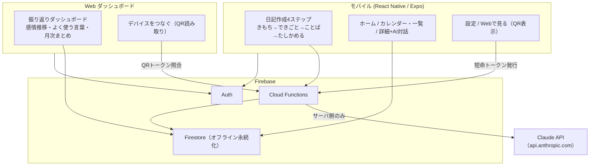
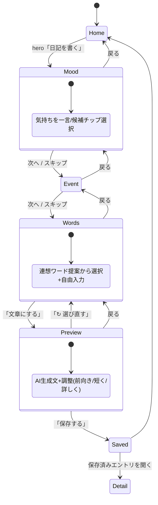
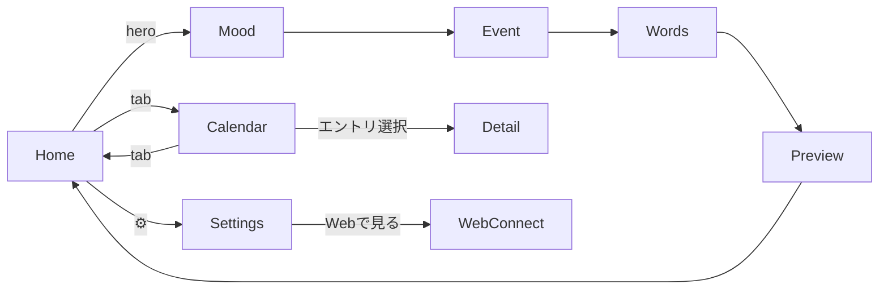
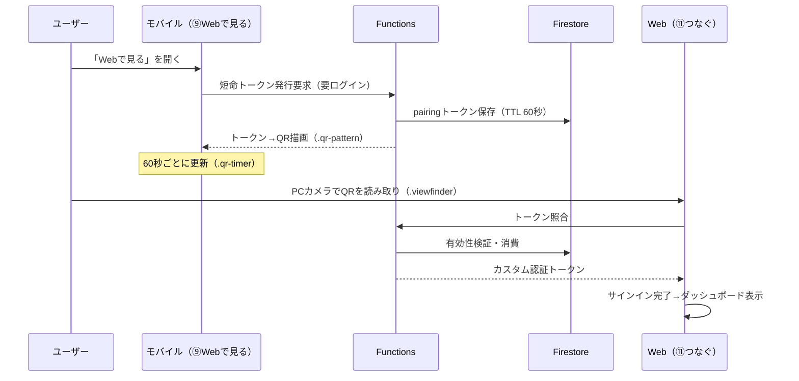
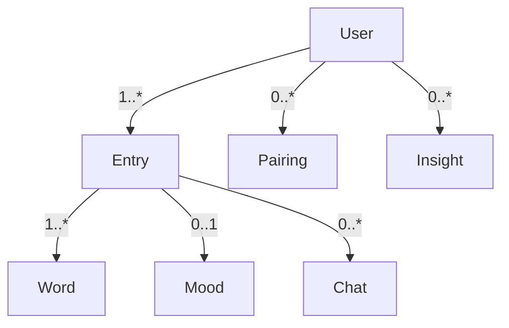

# たそがれ日記 基本設計書（basic-design）

> **位置づけ**: 本書はステップ2（要件定義）とステップ3（詳細設計）の橋渡しとして、アプリの**基本方針・全体構造**を固めるものである。詳細設計（`architecture.md` / `data.md` / `screen.md`、オーブのアニメーション詳細仕様等）は本書のあとの別タスクとする。
> **入力**: ① Notion「たそがれ日記」アプリエントリ（`アプリ別データベース`）、② `visual-design.html`（ビジュアルデザイン v1 / 画面確認用モック）、③ リポジトリの `CLAUDE.md` および `.claude/rules/`。
> **一次情報の扱い**: UI文言・配色・タイポグラフィは `visual-design.html` の実装（CSS変数・クラス名）を**正**として引用する。技術選定は要件に明記がない限り「案A/案B＋推奨案」で提示し断定しない。

> ⚠️ **前提に関する重大な注記**: 本書作成時点（2026-07-07）、Notion 側に**詳細な要件定義書は存在しなかった**。確認できたのはアプリDBエントリのプロパティ（本文は空）とロードマップ内の言及のみである。したがって本書は `visual-design.html` を要件の一次情報の中心に据えて構成し、Notion 要件との突き合わせで生じた空白は第8章「未確定事項一覧」に集約した。要件の正は本来 Notion であるため（`CLAUDE.md` 原則3）、ステップ2の要件定義書を整備したのち本書を再照合する必要がある。

---

## 1. 概要

> **本書が `visual-design.html` を要件の一次情報とする理由**: 要件の正は本来 Notion だが（`CLAUDE.md` 原則3）、本書作成時点で Notion 側に詳細要件定義書が存在しなかった（上記注記・第8章 U-02）。一方 `visual-design.html` は画面・文言・配色・遷移が具体実装として確定している。そこで本書は、確定済みの UI を一次情報の中心に据え、`CLAUDE.md`／`features.md` の記述と食い違う箇所（特に4ステップの定義：第3.2節・U-01）は HTML 側を暫定基準としつつ、矛盾を第8章に明示して要件側の更新を促す方針を採る。
>
> **要件トレース表の読み方**: 各章末の「要件トレース」表は、その章の**主要な**要件対応のみを示すもので、網羅を意図しない。粒度は章の主題に応じて異なる。

### 1.1 アプリの目的
「たそがれ日記」は、1日の終わり（たそがれ時）に**言葉を選ぶだけで日記になる**、AI駆動の日記コンパニオンアプリである。`visual-design.html` ではコンセプトを「**AIメモリトレース日記／コンパニオン体験**」と表現している（`<h1>AIメモリトレース日記 — たそがれ</h1>`、アプリ内タイトルは `.app-title` = 「たそがれ日記」）。

中核となる体験は次の2点：

- **書く負担の最小化**: 気持ち・できごとを単語で選ぶ／一言入力するだけで、AI が日記文を生成する（`.hero-line2` = 「言葉を選ぶだけで、日記になります」）。
- **やさしい伴走**: 過去の記録をたどって寄り添う AI 対話と、感情の移ろいを表す「呼吸するオーブ」による静かな可視化。連続記録日数などの達成バッジは**あえて設けない**（`visual-design.html` 末尾 `.note` = 「連続記録日数などのバッジ表示はあえて入れていません」）。

### 1.2 対象ユーザー・利用シーン
- **対象**: 日々の感情を軽く書き留めたいが、長文日記は続かない層。「疲れた」「なんとなく」といった曖昧な気持ちからでも記録を始められることを重視する。
- **主な利用シーン**: 就寝前など1日の終わりに、モバイルで数十秒〜数分。振り返りは後日、モバイルの一覧／カレンダー、または Web ダッシュボードで行う。

### 1.3 本書のスコープ
- **含む**: 全体アーキテクチャ、画面構成・遷移の概要、主要機能の基本方針、データ方針の前提整理、外部連携の基本方針、非機能要件の基本方針、未確定事項、次工程への申し送り。
- **含まない**: 詳細スキーマ（`data.md`）、状態管理の具体実装や画面ごとの詳細仕様（`architecture.md` / `screen.md`）、オーブアニメーションの数値仕様、API リクエスト/レスポンスの確定仕様（`api-contract.md`）、テスト計画。

| 要件トレース（第1章） | 対応元 |
|---|---|
| コンセプト「AI×キーワード選択で日記を生成」 | Notion アプリエントリ `テーマ・コンセプト` |
| コンパニオン体験・オーブ | `visual-design.html`（`.orb` / `.note`）、`features.md`「こころの灯オーブ」 |
| 4ステップ日記フロー | `CLAUDE.md`・`features.md`、`visual-design.html` `.nav`（②〜⑤） |

---

## 2. 全体アーキテクチャ

### 2.1 構成要素の位置づけ
| 層 | 実体 | 役割 |
|---|---|---|
| モバイルクライアント | React Native / Expo（Notion `プラットフォーム`） | 日々使う companion 体験。日記作成4ステップ、ホーム、カレンダー/一覧、詳細＋AI対話、設定、QR表示 |
| Web クライアント | ブラウザ（`tasogare-diary.app/dashboard`・`/connect`） | **分析・振り返り専用**のダッシュボード、デバイス連携（QR読み取り） |
| バックエンド | Firebase（Auth / Firestore / Functions） | 認証、データ保存・同期・バックアップ、Claude API の仲介 |
| AI | Claude API | 単語連想、文章生成、対話応答、週次/月次まとめ生成（**必ず Functions 経由**） |

### 2.2 構成図

> 本書の Mermaid 図は Mermaid v10 以上でのレンダリングを前提とする（GitHub / Notion のプレビューはこれに準拠）。日本語ラベルは折り返し表示になる環境があるため、確定図は詳細設計で描画確認する。

> **設計原則（明文化）**: 「※ モバイル版には表示しません。分析的な情報は Web のダッシュボードに限定し、日々使う companion 体験は引き続き軽やかに保ちます」（`visual-design.html` `.dash-note`）。**分析UI（グラフ・ランキング等）はモバイルに載せず Web に限定**する。モバイルに出す分析は、カレンダー画面の軽量な「週次インサイト」1枚（`.insight-card`）までに留める。

### 2.3 モバイルと Web の役割分担
- **モバイル**: 入力と日々の伴走。編集・生成・保存・軽い振り返り・AI対話。
- **Web**: 読み取り中心の俯瞰。感情推移グラフ（`.mood-chart`）、よく使う言葉ランキング（`.word-rank`）、AIによる月次まとめナラティブ（`.dash-narrative`）。書き込み機能は持たせない方針（未確定：第8章）。

| 要件トレース（第2章） | 対応元 |
|---|---|
| React Native/Expo・Claude API・Firebase | Notion `技術スタック` |
| Claude API はクライアント直叩き禁止 | `constraints.md`・`environments.md` |
| 分析はWeb限定 | `visual-design.html` `.dash-note` |

---

## 3. 画面構成・画面遷移概要

### 3.1 画面一覧
`visual-design.html` の `.nav`（①〜⑪）を根拠とする。

| # | 画面 | 実装ID | 種別 | 主な要素（クラス） |
|---|---|---|---|---|
| ① | ホーム | `home` | モバイル | `.hero-zone`/`.orb`、`.week-strip`、`.entry-card`、`.tab-bar` |
| ② | きもち（step1） | `mood1` | モバイル | `.step-progress`、`.input-row`、`.pebble`（候補チップ）、`.skip-link` |
| ③ | できごと（step2） | `event1` | モバイル | `.recap-row`、`.input-row`、`.pebble`、`.skip-link` |
| ④ | ことば（step3） | `combine1` | モバイル | `.associate-note`（連想）、`.pebble.on`、`.selected-chips` |
| ⑤ | たしかめる（step4） | `create2` | モバイル | `.note-card`（生成文）、`.adjust-row`（調整）、`.mood-preview-row`、`.primary-btn`（保存） |
| ⑥ | カレンダー/一覧 | `calendar` | モバイル | `.view-toggle`、`.cal-grid`、`.list-entry`、`.insight-card`（週次） |
| ⑦ | 詳細＋AI対話 | `detail` | モバイル | `.diary-full-text`、`.mood-badge`、`.chat-bubble`、`.chat-input-row` |
| ⑧ | 設定 | `settings` | モバイル | `.settings-row`（Webで見る／バックアップする） |
| ⑨ | Webで見る（QR表示） | `webConnect` | モバイル | `.qr-card`/`.qr-pattern`、`.qr-timer-track`、`.ghost-btn`（Apple/Google） |
| ⑩ | ダッシュボード（Web） | `dashboardView` | Web | `.dash-narrative`、`.mood-chart`、`.word-rank`、`.period-tabs` |
| ⑪ | デバイスをつなぐ（Web） | `connectView` | Web | `.viewfinder`、`.connect-status`、`.ghost-btn`（Apple/Google） |

### 3.2 4ステップ日記作成フロー
`visual-design.html` の実装フローは **きもち→できごと→ことば→たしかめる** であり、各画面の `.step-progress`（4ドット）で進捗を示す。

> **重要な差異（第8章に再掲）**: `CLAUDE.md`／`features.md` が定義する4ステップは「①出来事 ②気持ち ③Claude API 応答 ④こころの灯を灯す」だが、`visual-design.html` の実装は「①きもち ②できごと ③ことば ④たしかめる（生成文プレビュー→保存）」で、**順序・ステップ内容が一致しない**。特に「Claude API の寄り添い応答」は独立ステップではなく、詳細画面⑦の AI対話として存在する。UI を正とするため本書は HTML 側の4ステップを基準とするが、要件定義書側の記述更新が必要。

### 3.3 主要な画面遷移（モバイル全体）

### 3.4 モバイル⇔Web 連携（QR）のシーケンス概要

代替経路として、両画面に「Apple / Google でサインイン」（`.ghost-btn`）を用意し、QR が使えない場合のフォールバックとする。

| 要件トレース（第3章） | 対応元 |
|---|---|
| 画面一覧①〜⑪ | `visual-design.html` `.nav` |
| 4ステップ | `features.md`（順序差異あり）／`visual-design.html` `.step-progress` |
| QRペアリング | `features.md`「QRペアリング」／`visual-design.html` `webConnect`・`connectView` |

---

## 4. 主要機能の基本方針

### 4.1 日記作成支援（単語選択・連想ワード提案・文章生成）
概念レベルの処理フロー：

1. **きもち／できごと入力**: ユーザーが一言入力、または候補チップ（`.pebble`）を選択。候補チップは初期は固定＋利用傾向で差し替え（生成主体は未確定：第8章）。
2. **連想ワード提案（ことば）**: 直前の「きもち・できごと」＋過去の傾向を入力に、Claude API が関連語を提案（`.associate-note` = 「『疲れた』『カフェ』と、これまでの傾向から連想しました」）。ユーザーは選択（`.pebble.on`）・除外（`×`）・自由追加できる。
   - 入力（概念）: 選択済み単語配列＋過去頻出語。出力: 連想語候補配列。
3. **文章生成（たしかめる）**: 選択語群から Claude API が日記文（`.note-card`）を生成。
   - 入力（概念）: 確定単語配列＋感情ラベル。出力: 日記本文（1段落）＋推定感情ラベル。
4. **調整**: 「もっと前向きに／短くして／詳しく／↻選び直す」（`.adjust-row`）で再生成。保存後も調整可（`.mood-preview-note` = 「保存後もいつでも調整できます」）。

### 4.2 AI との対話（詳細画面のチャット）
- 保存済みエントリの詳細⑦で、その日の記録を文脈に Claude と対話（`.chat-bubble.ai` / `.me`）。過去記録の参照を含む（例: 「1ヶ月前も同じような日に『疲れた』と書いていましたよ」）。
- **スコープ**: 寄り添い・振り返りの範囲に限定し、助言の断定や診断は行わない（第7章プライバシー方針と整合）。
- **会話履歴の保存要否は未確定**（第8章）。保存する場合は日記本文と同じセンシティブ度で uid スコープ管理。

### 4.3 カレンダー／一覧・週次/月次インサイト
- **カレンダー/一覧**（モバイル⑥）: 日ごとにオーブ色で感情を示し（`.cal-cell .orb-mini`）、リストはタグ付きで表示（`.list-entry`）。キーワード検索あり（`.search-row`）。
- **週次インサイト**（モバイル⑥）: 軽量な気づき1枚（`.insight-card`）。
- **月次まとめ**（Web⑩）: ナラティブ（`.dash-narrative`）＋感情推移（`.mood-chart`）＋よく使う言葉（`.word-rank`）。
- **生成主体（案）**:
  - 案A: クライアント集計＋Claude で文章化。低コストだが端末差・オフライン整合に難。
  - 案B（推奨）: **Functions で集計・キャッシュし、Claude で文章化**。Web と整合し、送信データを最小化しやすい。負荷は Web 表示時のオンデマンド＋日次バッチの折衷。
  - 案C: 完全オンデマンド生成。実装は軽いが応答遅延・API コスト増。

### 4.4 Web版デバイス連携（QRペアリング）の認証方式（案）
- 案A（推奨）: **短命回転トークン方式**。モバイルが要ログイン状態で Functions からTTL60秒のトークンを取得→QR化。Web はトークンを Functions で照合し**カスタム認証トークン**を得てサインイン。`visual-design.html` の「60秒ごとに更新」（`.qr-timer-label`）と一致。
- 案B: Firebase Dynamic Links 的方式。※ Dynamic Links はサービス終了方針のため**非推奨**。
- 案C: Apple/Google サインインを主とし、QR は補助。HTML の `.ghost-btn` と整合するがPC⇔スマホの即時連携体験は弱まる。
- いずれも最小権限（`constraints.md`）を原則とし、トークンは一度きり消費・短寿命とする。

| 要件トレース（第4章） | 対応元 |
|---|---|
| 単語連想・文章生成・調整 | `visual-design.html` ④⑤／`features.md`「Claude API連携」 |
| AI対話 | `visual-design.html` ⑦ |
| 週次/月次インサイト | `visual-design.html` ⑥⑩ |
| QR認証 | `features.md`／`visual-design.html` ⑨⑪ |

---

## 5. データ方針（`data.md` に向けた前提整理）

> 詳細スキーマは対象外。主要エンティティと概要のみを示す。

### 5.1 主要エンティティ（仮）
| エンティティ | 概要 | 主な属性（概念） |
|---|---|---|
| ユーザー | 認証主体 | uid、サインイン方式（Apple/Google）、作成日時 |
| 日記エントリ | 1日1件を基本 | 日付、生成本文、感情ラベル、選択語群、作成/更新日時、調整履歴の要否（未確定） |
| 選択ワード／タグ | 気持ち・できごと・連想語 | 語、カテゴリ（mood/event/assoc）、頻度 |
| 気分値 | 感情ラベル | 3段階（後述） |
| 対話（チャット） | 詳細画面の会話 | エントリID、メッセージ列（ai/me）、保存要否（未確定） |
| デバイス連携情報 | QRペアリング | 短命トークン、発行/失効時刻、消費フラグ |
| インサイト/まとめ | 週次・月次 | 期間、集計値、生成ナラティブ、キャッシュ日時 |

エンティティ関係（概念）：

### 5.2 感情ラベルの管理方針
`visual-design.html` の凡例（`.legend`）は3段階：**穏やか（`--calm` #7FA48F）／やや疲れ（`--tender` #C0975A）／しんどい（`--heavy` #B27E7E）**。オーブ・カレンダー・バッジで同一色体系を用いる。方向性として、内部値は3段階の列挙（例: `calm`/`tender`/`heavy`）で保持し、表示ラベルと色は UI 定数に集約する。多段階化・数値スコア化は将来拡張余地として残す（第8章）。

### 5.3 ローカル保存とクラウド同期
- 入力途中の下書き（各ステップの選択語）はローカルに保持し、オフラインでも中断・再開できる（`constraints.md`）。
- 確定エントリは Firestore に保存し、オフライン永続化で復帰時に同期。
- 保存先の具体（Firestore オフライン＋端末ローカルストアの併用可否）は詳細設計で確定（第9章）。

| 要件トレース（第5章） | 対応元 |
|---|---|
| 感情3段階・色 | `visual-design.html` `.legend`/CSS変数 |
| オフライン下書き・同期 | `constraints.md`「オフライン対応」 |
| uid スコープ | `constraints.md`「プライバシー」 |

---

## 6. 外部連携の基本方針

### 6.1 Claude API 連携
- **用途**: ①連想ワード提案 ②日記文生成 ③調整（再生成）④AI対話 ⑤週次/月次まとめ生成。
- **接続**: クライアント直叩き禁止、**必ず Firebase Functions 経由**（`environments.md`／`constraints.md`）。API キーは Functions config／Secrets で管理。
- **モデル選定（案・推奨）**: 低遅延が要る対話・連想は軽量モデル（例: Claude Haiku 系）、月次まとめ等の質重視は上位モデル（例: Claude Sonnet／Opus 系）を用途別に使い分ける方針。確定は詳細設計＋コスト試算後（第9章）。
- **送信データ最小化**: 応答生成に必要な最小限のみ送信し、本文の二次利用はしない（第7章）。

### 6.2 Firebase 連携
- **Auth**: Apple/Google サインイン（`visual-design.html` `.ghost-btn`）。
- **Firestore**: 日記・ワード・連携情報を uid スコープで保存。オフライン永続化を有効化。セキュリティルールで本人のみ read/write。
- **Functions**: Claude 仲介、QRトークン発行/照合、集計バッチ（案B採用時）。
- **バックアップ**: 設定「バックアップする」（`.settings-row` = 「機種変更・削除に備えてアカウントを保存」）。方式は詳細設計で確定。

### 6.3 QRペアリングの技術方式候補
第4.4節の案A（短命回転トークン・推奨）／案B（Dynamic Links的・非推奨）／案C（OAuth主）を参照。

| 要件トレース（第6章） | 対応元 |
|---|---|
| Claude API の5用途 | `visual-design.html` ④⑤⑥⑦⑩ |
| Functions 経由・キー秘匿 | `environments.md`／`constraints.md` |
| Auth/バックアップ | `visual-design.html` `settings` |

---

## 7. 非機能要件の基本方針

### 7.1 パフォーマンス
- 画面遷移・入力は60fps目標。オーブ（`breathe` アニメ、4.8s）等の常時アニメは軽量に保ち、`react-native-reanimated`（UIスレッド）での実装を想定（`constraints.md`）。
- Claude 応答は非同期・ローディング表現でフリーズ回避。一覧は仮想化（`FlatList` 等）。

### 7.2 アクセシビリティ（既存CSSの意図を明文化）
`visual-design.html` は次を意図的に実装しており、本実装でも踏襲する：
- **キーボード/フォーカス可視化**: `:focus-visible` によるアウトライン（`.nav button`、`.primary-btn`、`.hero-zone`、`.settings-icon` 等）。RN では対応するフォーカス/アクセシビリティ属性で担保。
- **モーション低減**: `@media (prefers-reduced-motion:reduce)` で `.orb` / `.viewfinder` / `.pulse-dot` のアニメを停止。RN では `AccessibilityInfo.isReduceMotionEnabled` で同等制御。
- **操作要素の意味付け**: `role="button"` `tabindex="0"` ＋ Enter/Space ハンドラ相当を、RN の `accessibilityRole` 等で付与。
- **可読性**: たそがれ配色でも十分なコントラストを確保（`--ink` 系と `--paper` 系）。文字サイズ変更に配慮（`constraints.md`）。

### 7.3 プライバシー・データ取り扱い方針（独立方針・必須）
日記は極めてセンシティブな感情記録である。本アプリはこれを最優先の設計制約とする（`constraints.md` を基盤に明文化）：
- **鍵の秘匿**: Claude API キーはクライアントに置かず、必ず Functions 経由（第6章）。
- **本人限定アクセス**: 全データは uid スコープ。Firestore セキュリティルールで本人のみ read/write を強制。
- **二次利用の禁止**: 日記本文を分析・学習等に転用しない。Claude へは応答生成に必要な最小限のみ送信。
- **削除権**: ユーザーは自分の日記・アカウントを削除でき、削除時は関連データ（日記・対話・ペアリング情報）も確実に削除。
- **ログ最小化**: ログ・分析に本文や個人特定情報を残さない。
- **連携の安全性**: QR は短命・一度きり消費トークン。Web ダッシュボードは読み取り中心とし、権限は最小限。

### 7.4 オフライン時の挙動方針
- 下書き・入力はオフライン継続可（ローカル保存→復帰時同期）。
- Claude を要する処理（連想・生成・対話・まとめ）は**ネットワーク必須**。オフライン時はその旨を明示し、入力済みデータは保全（`constraints.md`）。

| 要件トレース（第7章） | 対応元 |
|---|---|
| 60fps・reanimated・仮想化 | `constraints.md`「パフォーマンス」 |
| focus-visible / reduced-motion | `visual-design.html` CSS |
| プライバシー・削除・ログ | `constraints.md`「プライバシー・データ保持」 |
| オフライン | `constraints.md`「オフライン対応」 |

---

## 8. 未確定事項一覧

要件定義書（Notion）と `visual-design.html` の突き合わせで判明した矛盾・空白点。

| # | 種別 | 内容 | 影響 |
|---|---|---|---|
| U-01 | 矛盾 | **4ステップの定義不一致**: `features.md`「出来事→気持ち→応答→灯」 vs HTML「きもち→できごと→ことば→たしかめる」。順序・内容・「Claude応答」の位置が異なる | 画面遷移・要件全体。要件定義書の更新要 |
| U-02 | 空白 | **Notion に詳細要件定義書が未作成**（アプリDBエントリはプロパティのみ、本文空） | 本書の各章が HTML 依存。要件の正が未整備 |
| U-03 | 矛盾 | **「こころの灯」の位置づけ**: `features.md` は達成表現的な「灯を灯す」ステップ、HTML は感情を表す常時サイン「呼吸するオーブ」。バッジ/ストリークは HTML で明確に不採用 | オーブ仕様・ゲーミフィケーション方針 |
| U-04 | 空白 | **Web クライアントの存在**が `CLAUDE.md`/rules に未記載（HTML には⑩⑪あり）。技術スタック・環境定義に Web が無い | アーキテクチャ・環境・工数 |
| U-05 | 未確定 | AI対話の**会話履歴の保存要否**と保持期間 | データ設計・プライバシー |
| U-06 | 未確定 | 候補チップ／連想ワードの**生成主体**（固定辞書か、傾向学習か、都度Claudeか） | API コスト・パフォーマンス |
| U-07 | 未確定 | 週次/月次インサイトの**生成主体・キャッシュ方針**（案A/B/C） | 負荷・コスト・整合 |
| U-08 | 未確定 | QRペアリングの**認証方式確定**（案A推奨だが要決定） | セキュリティ設計 |
| U-09 | 未確定 | Web ダッシュボードは**閲覧専用か編集可か** | 権限・ルール設計 |
| U-10 | 未確定 | 感情ラベルの**多段階化/数値化**の将来方針（現状3段階） | データ・可視化 |
| U-11 | 未確定 | 1日**複数エントリの可否**（HTML は1日1件を示唆） | データ設計 |
| U-12 | 未確定 | Claude **モデル選定**とコスト上限、レート制御・失敗時リトライ方針 | 非機能・コスト |
| U-13 | 未確定 | バックアップの**具体方式**（Firestoreエクスポート/アカウント連携の粒度） | データ保全 |
| U-14 | 未確定 | 対応言語（現状日本語のみ）と**将来多言語化**の扱い | i18n設計 |

---

## 9. 次工程への申し送り事項

詳細設計（`architecture.md` / `data.md` / `screen.md`、オーブアニメーション仕様）で決定すべき論点。

- **要件の整備（最優先・時間軸）**: **ステップ2（要件定義）の完了時までに** Notion 要件定義書を整備し、U-01/U-02/U-03 を確定させたうえで本書を再照合する（要件の正は Notion：`CLAUDE.md` 原則3）。特に4ステップの定義を一本化する。これが未確定のままステップ3（詳細設計）へ進むと、`architecture.md`／`screen.md` に矛盾が波及するため、要件確定を詳細設計着手の前提条件とする。
- **`architecture.md`**:
  - モバイルのナビゲーション構成（React Navigation：native stack ＋ bottom tabs 想定）と状態管理（案: Redux Toolkit / Zustand / Context — **Zustand を推奨**、companion 体験の軽さと学習コスト観点）。
  - Web ダッシュボードの実装方式（案A: Next.js 別アプリ＋Firebase Hosting／案B: Expo Web でコード共有／案C: 軽量SPA）。U-04 の意思決定を含む。
  - オーブアニメーションの数値仕様（`breathe` 4.8s / scale 1↔1.055、reduced-motion 分岐）と感情色の適用規則。
- **`data.md`**: 第5章エンティティの確定スキーマ、Firestore コレクション構造とセキュリティルール、オフライン同期戦略、U-05/U-09/U-10/U-11 の確定。
- **`api-contract.md`**: Claude 各用途（連想/生成/調整/対話/まとめ）と QR発行・照合の Functions エンドポイント仕様、認証方式（U-08）、モデル・コスト（U-12）。
- **プライバシー詳細設計**: 削除フローの網羅（対話・ペアリング含む）、ログのマスキング方針、Claude 送信ペイロードの最小化仕様。
- **レビュー判断**: 本書のスコープ（基本方針・全体構造）は充足。上記 U-01〜U-04 の要件確定が取れ次第、詳細設計へ着手可能。

---

### 付録A. 参照した一次情報・版管理
- **本書作成日**: 2026-07-07（ステップ2〜3 橋渡し工程）
- Notion「たそがれ日記」アプリエントリ（`アプリ別データベース` / `関東武者修行 3年ロードマップ` 配下）— 参照時点 2026-07-03 版、プロパティのみ（本文空）。
- `visual-design.html`（ビジュアルデザイン **v1** / 配色・タイポグラフィ確認用）— 画面①〜⑪、CSS変数（配色）、フォント定義、アニメーション、アクセシビリティ実装。
- リポジトリ: `CLAUDE.md`、`.claude/rules/{features,constraints,environments,git-workflow,build-commands}.md`（`develop` ブランチ時点）。
- 次回再照合の契機: ステップ2の Notion 要件定義書が確定した時点（U-01/U-02/U-03 の解消）。

### 付録B. 配色・タイポグラフィ（`visual-design.html` を正）
- **フォント**: 見出し・日記本文＝`--font-display`（'Klee One', 'Hiragino Mincho ProN', serif）／UI＝`--font-ui`（'Zen Maru Gothic', 'Hiragino Sans', sans-serif）。
- **基調色**: 紙 `--paper` #F1EFEE / `--paper-soft` #FBFAF8、墨 `--ink` #302E3A・`--ink-soft` #726F7C・`--ink-faint` #ACA9B2、たそがれ `--dusk` #8C6F8C・`--dusk-deep` #6F5670・`--dusk-soft` #EFE7EE、境界 `--line` #E5E1DD。
- **感情色**: 穏やか `--calm` #7FA48F、やや疲れ `--tender` #C0975A、しんどい `--heavy` #B27E7E（各 `-soft` 変種あり）。
