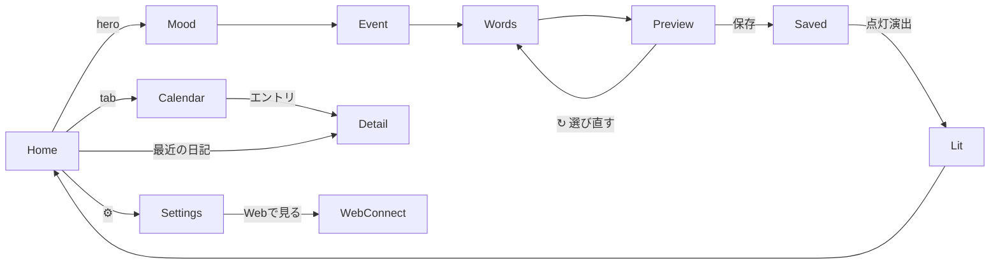

# たそがれ日記 詳細設計：画面仕様（screen.md）

> **位置づけ**: ステップ3（詳細設計）。[architecture.md](architecture.md) のナビゲーション・状態管理・デザインシステム、[data.md](data.md) のスキーマを前提に、各画面のレイアウト・要素・状態（ローディング/空/エラー）・遷移・操作・アクセシビリティを定義する。API は [api-contract.md](api-contract.md)（後続作成）。
> **UI の正**: `visual-design.html` v1（画面ID・クラス名・文言を引用）。要件の正: Notion [たそがれ日記 要件定義書](https://app.notion.com/p/395cd5c5312e81b0b73fc2d95219b084)。
> **表記**: 「クラス」は `visual-design.html` の CSS クラス。RN 実装名は [architecture.md](architecture.md) 第5.3節のコンポーネント対応に従う。

---

## 0. 共通規約

### 0.1 画面一覧（`visual-design.html` `.nav` ①〜⑪）
| # | 画面 | ID | 種別 | 節 |
|---|---|---|---|---|
| ① | ホーム | `home` | モバイル | 3.1 |
| ② | きもち | `mood1` | モバイル | 3.2 |
| ③ | できごと | `event1` | モバイル | 3.3 |
| ④ | ことば | `combine1` | モバイル | 3.4 |
| ⑤ | たしかめる | `create2` | モバイル | 3.5 |
| － | 灯（演出） | － | オーバーレイ | 3.6 |
| ⑥ | カレンダー/一覧 | `calendar` | モバイル | 3.7 |
| ⑦ | 詳細＋AI対話 | `detail` | モバイル | 3.8 |
| ⑧ | 設定 | `settings` | モバイル | 3.9 |
| ⑨ | Webで見る（QR） | `webConnect` | モバイル | 3.10 |
| ⑩ | ダッシュボード | `dashboardView` | Web | 4.1 |
| ⑪ | デバイスをつなぐ | `connectView` | Web | 4.2 |

### 0.2 共通コンポーネント
- **ステータスバー**（`.status-bar`）: 端末標準に置換（モックの `9:41` は不要）。
- **サブ画面ヘッダー**（`.screen-header`）: 戻る（`.back-btn`）＋タイトル（`.header-title`）or ステップ進捗（`.step-progress`）。
- **下部タブ**（`.tab-bar`）: ホーム／カレンダーのみ（詳細・作成フロー・設定では非表示）。
- **主ボタン**（`.primary-btn`）／ゴースト（`.ghost-btn`）／候補チップ（`.pebble`）。

### 0.3 状態表現の共通ルール
| 状態 | 方針 |
|---|---|
| ローディング | Claude 応答・保存中はプレースホルダ/スピナーで**フリーズさせない**（[constraints.md](../.claude/rules/constraints.md)）。ボタンは二度押し防止で無効化。 |
| 空 | 一覧系は空文言（例「まだ日記がありません」）＋日記導線。 |
| エラー | ネットワーク/API 失敗は非破壊的トースト＋再試行。**入力・下書きは保持**。 |
| オフライン | Claude 必須処理（連想/生成/対話/まとめ）はオフライン時に不可の旨を明示し、下書きは保存（[architecture.md](architecture.md) 第7章）。 |

### 0.4 アクセシビリティ共通
- フォーカス可視化（`:focus-visible` 相当）、操作要素に `accessibilityRole`/ラベル、Enter/Space 相当の活性化。
- `prefers-reduced-motion` 相当でオーブ等のアニメを停止/簡略化（[architecture.md](architecture.md) 第8章）。
- たそがれ配色でも十分なコントラスト、文字サイズ変更に追従。

---

## 1. 画面遷移マップ

> 詳細な戻る遷移・状態は [architecture.md](architecture.md) 第3.3節を参照。

---

## 2. 日記作成フロー共通
- **進捗**（`.step-progress` / `.step-dot`）: 4ドット。current/done/未到達で表現（`.step-dot.current` / `.done`）。灯は進捗に含めない。
- **recap**（`.recap-row` / `.recap-tag`）: 前ステップの選択を要約表示（例「気持ち：疲れた」）。
- **スキップ**（`.skip-link`「今は思い浮かばない」）: きもち/できごとで可。スキップ時は当該項目を空として次へ。
- **下書き**: 各ステップの入力は `draftStore` に即時保持（オフライン継続）。
- **入力**（`.input-row` + `.add-btn`）と**候補チップ**（`.pebble`、`.divider-or`「または」で区切り）。

---

## 3. モバイル画面

### 3.1 ホーム（`home`）
- **目的**: その日の入口。オーブで感情の余韻を示し、日記作成へ誘導。
- **要素**: アプリ名（`.app-title`）／日付（`.date-label`）／設定（`.settings-icon` ⚙）／ヒーロー（`.hero-zone` + 大 `.orb` + `.hero-btn`「日記を書く」）／この一週間（`.week-strip`：7日分 `.orb-mini`）／最近の日記（`.entry-card` × N）／下部タブ。
- **データ**: `entries`（直近数件、`date` 降順）、週間は直近7日の各日 `mood`。
- **状態**: 空＝オーブ＋導線のみ（週/一覧は空文言）。ローディング＝一覧スケルトン。
- **遷移**: ヒーロー/⚙/タブ/エントリタップ → Mood / Settings / Calendar / Detail。
- **A11y**: `.hero-zone` は role=button・Enter/Space 活性化（モック実装済み）。オーブは reduced-motion で静止。

### 3.2 きもち（`mood1`／step1）
- **目的**: いまの気持ちを一言または候補から選ぶ。
- **要素**: ヘッダー（戻る＋進捗「きもち」current）／プロンプト（`.prompt-text`「今、どんな気持ちですか？」＋`.prompt-sub`「一言で大丈夫です」）／入力（`.input-row` placeholder「疲れた、とか…」＋`.add-btn`）／「または」／候補（`.chip-suggest-label`「言葉が浮かばないときは」＋`.chip-row` の `.pebble`）／次へ（`.primary-btn`）／スキップ（`.skip-link`）。
- **データ書込**: `draftStore.mood`（自由語/選択語）。感情 enum は後段（たしかめる）で Claude 推定（[data.md](data.md) 第4章）。
- **状態**: 未入力でも「次へ」可（スキップ相当）。候補チップは固定＋傾向差し替え（生成主体 U-06）。
- **遷移**: 次へ→Event／戻る→Home。

### 3.3 できごと（`event1`／step2）
- **目的**: きょうのできごとを一言または候補から選ぶ。
- **要素**: 進捗「できごと」current（step1 done）／recap（`.recap-tag`「気持ち：**疲れた**」）／プロンプト「今日は何をしていましたか？」／入力＋候補（`.pebble`「カフェ/仕事/友達と…」）／次へ／スキップ。
- **データ書込**: `draftStore.words`（category=`event`）。
- **遷移**: 次へ→Words／戻る→Mood。

### 3.4 ことば（`combine1`／step3）
- **目的**: きもち・できごと＋傾向から Claude が連想語を提案し、取捨選択する。
- **要素**: 進捗「ことば」current／recap（気持ち・できごと）／プロンプト（`.prompt-text`「そこから、こんな言葉も浮かびました」）／連想の説明（`.associate-note`）／候補（`.pebble`、選択は `.pebble.on`＋`×` で解除）／自由追加（`.divider-or`「他にしっくりくる言葉があれば」＋`.input-row`）／選んだ言葉（`.selected-label`「選んだ言葉（N）」＋`.selected-chips`）／「文章にする」（`.primary-btn`）。
- **入出力（概念）**: 入力＝選択済み語＋過去頻出語 → 出力＝連想候補（[data.md](data.md)／api-contract.md）。
- **状態**: **連想取得中**＝候補エリアにローディング。取得失敗＝再試行＋手動入力で継続可。オフライン＝連想不可の明示、手動入力は可。
- **遷移**: 文章にする→Preview／戻る→Event。

### 3.5 たしかめる（`create2`／step4）
- **目的**: 選択語から生成した日記文を確認・調整して保存。
- **要素**: 進捗「たしかめる」current／生成文（`.note-card` + `.note-tape`）／調整（`.adjust-label`「調整する」＋`.adjust-row` の `.ghost-btn`「もっと前向きに/短くして/詳しく/↻選び直す」）／感情プレビュー（`.mood-preview-row`：`.orb-mini`＋`.mood-preview-text`「やや疲れの一日」＋`.mood-preview-note`「保存後もいつでも調整できます」）／保存（`.primary-btn`「保存する」）。
- **入出力（概念）**: 入力＝確定語＋感情 → 出力＝本文＋推定感情ラベル（[data.md](data.md) 第3.2/4章）。
- **状態**: **生成中/再生成中**＝`.note-card` にローディング、調整ボタン無効化。**保存中**＝ボタン無効化（二度押し防止）。保存失敗＝下書き保持＋再試行。
- **書込**: 成功時 `entries`（bodyText/mood/words/…）作成 → 灯の演出へ。「↻選び直す」→Words。
- **遷移**: 保存→（灯）→Home or Detail／戻る→Words。

### 3.6 灯の演出（保存後）
- **目的**: 保存完了を「こころの灯」が灯る演出で締める（要件定義書 §4.1）。**専用入力画面は持たない**オーバーレイ/トランジション。
- **表現**: ホーム大オーブへ遷移しつつ、グロー→当日の感情色へ収束→気づき一言を短くフェード表示（詳細数値は [architecture.md](architecture.md) 第8.2節）。所要 ~1.2–1.6s。
- **reduced-motion**: グロー省略、感情色反映＋一言のクロスフェードのみ。
- **遷移**: 完了で Home（オーブ更新）。保存直後に詳細を開く導線も可。
- **データ**: `entries.awareness`（気づき一言、任意）。

### 3.7 カレンダー/一覧（`calendar`）
- **目的**: 過去の記録の俯瞰と検索。
- **要素**: ヘッダー（`.app-title`「過去の日記」）／表示切替（`.view-toggle`「カレンダー/リスト」）。
  - **カレンダー**（`#calendarView`）: 月ラベル／曜日行（`.weekday-row` 月〜日）／グリッド（`.cal-grid` の `.cal-cell`、日ごと `.orb-mini` で感情）／凡例（`.legend` 穏やか/やや疲れ/しんどい）／週次インサイト（`.insight-card`「今週の傾向」）。
  - **リスト**（`#listView`）: 検索（`.search-row`）／月見出し（`.month-divider`）／エントリ（`.list-entry`：日付＋本文2行省略＋タグ＋`.orb-mini`）。
- **データ**: `entries`（`date` 範囲/降順）、`insights`（`weekly`、[data.md](data.md) 第3.5節）。感情色は共通トークン。
- **状態**: 空＝「まだ日記がありません」。検索0件＝該当なし表示。インサイト生成前＝非表示 or プレースホルダ。
- **遷移**: エントリ→Detail／タブ→Home。

### 3.8 詳細＋AI対話（`detail`）
- **目的**: 1件の日記を読み、AI と振り返る。
- **要素**: ヘッダー（戻る＋日付タイトル）／本文（`.diary-full-text`, display フォント）／タグ（`.tags-used`）／感情バッジ（`.mood-badge` + `.orb-mini`）／「AIと話す」（`.section-label`）／会話（`.chat-bubble.ai`/`.me`）／入力（`.chat-input-row` + `.send-btn`）。
- **データ**: `entries/{id}`、`messages`（`createdAt` 昇順、保存要否 U-05／既定=保存、[data.md](data.md) 第3.3節）。
- **状態**: **AI応答待ち**＝送信後にタイピング/プレースホルダ。送信失敗＝再試行、入力保持。オフライン＝対話不可の明示。空対話＝AI からの最初の問いかけを表示。
- **操作**: 本文の再調整（保存後調整、`.mood-preview-note` の方針）を将来導線化（未確定）。
- **遷移**: 戻る→前画面（Calendar/Home）。

### 3.9 設定（`settings`）
- **目的**: Web連携・バックアップ等の入口。
- **要素**: ヘッダー（戻る＋「設定」）／行（`.settings-row`）: 「Webで見る」（`.settings-row-sub`「パソコンから日記を見られるようにする」）／「バックアップする」（「機種変更・削除に備えてアカウントを保存」）。
- **遷移**: 「Webで見る」→WebConnect。バックアップ→（方式未確定 U-13）。
- **将来**: アカウント削除・reduced-motion 等の設定項目を追加（データ削除は [data.md](data.md) 第7章）。

### 3.10 Webで見る（QR）（`webConnect`）
- **目的**: PC でダッシュボードを見るためのデバイス連携（QR 表示）。
- **要素**: ヘッダー（戻る＋「Webで見る」）／説明（`.prompt-text`「パソコンでも、書いた日記をそのまま見られます」＋`.prompt-sub`「下のコードを、パソコンのブラウザで読み取ってください」）／QR（`.qr-card` + `.qr-pattern` + `.qr-finder`）／タイマー（`.qr-timer-track`/`.qr-timer-fill` + `.qr-timer-label`「60秒ごとに更新」）／「または」＋Apple/Google サインイン（`.ghost-btn`）／注記「スマホの日記データはそのまま、安全に保たれます」。
- **データ**: Functions が `pairings` に短命トークン発行（TTL 60s、[data.md](data.md) 第3.6節）。60秒ごとに再発行し QR 更新。
- **状態**: 要ログイン（未ログイン時はサインイン導線）。発行失敗＝再試行。タイマー満了＝自動更新。
- **A11y**: QR は装飾。代替として Apple/Google サインインを常時提供。

---

## 4. Web 画面（振り返り専用）

### 4.1 ダッシュボード（Web）（`dashboardView`）
- **目的**: 月次中心の俯瞰。分析はここに集約（モバイルに出さない、[basic-design.md](design/basic-design.md) 第2.2節）。
- **要素**: ブラウザ枠（`.browser-url` `tasogare-diary.app/dashboard`）／サイドバー（`.dash-sidebar`：ホーム/カレンダー/ダッシュボード）／ヘッダー（`.dash-title`「振り返りダッシュボード」＋期間タブ `.period-tabs` 今週/今月/過去3ヶ月）／AIまとめ（`.dash-narrative`「AIによる今月のまとめ」＋`.dash-narrative-text`）／感情推移（`.dash-card`「感情の推移（週ごと）」＋`.mood-chart` 積み上げ＋`.legend`）／よく使う言葉（`.word-rank` 上位N＋件数）／注記（`.dash-note`：モバイル非表示の設計原則）。
- **データ**: `insights`（`monthly` 主、`moodDistribution`/`topWords`/`narrative`）、`wordStats`（[data.md](data.md) 第3.4/3.5節）。生成は Functions（案B）。
- **状態**: 生成前＝プレースホルダ。データ不足（記録少）＝その旨を表示。読取専用（編集可否 U-09）。
- **A11y**: グラフに数値/凡例を併記、色のみに依存しない。

### 4.2 デバイスをつなぐ（Web）（`connectView`）
- **目的**: モバイルの QR を PC カメラで読み取り、Web をサインインさせる。
- **要素**: ブラウザ枠（`.browser-url` `.../connect`）／ビューファインダ（`.viewfinder` + `.vf-corner`、`softPulse`）／タイトル「スマホのQRコードを映してください」／説明（`.connect-sub`）／状態（`.connect-status` + `.pulse-dot`「読み取り待機中…」）／「うまく読み取れない場合」＋Apple/Google サインイン（`.ghost-btn`）。
- **フロー**: QR トークンを Functions が照合→カスタム認証トークン発行→サインイン（[architecture.md](architecture.md) 第3.4節相当のシーケンス、詳細は api-contract.md）。
- **状態**: 待機/読取成功/失効・不正トークン（再取得を促す）/成功（ダッシュボードへ）。
- **A11y**: カメラ不可環境向けに Apple/Google サインインを代替提供。`softPulse` は reduced-motion で停止。

---

## 5. 要件・設計トレース
| 本書の対象 | 対応元 |
|---|---|
| 画面①〜⑪・文言・クラス | `visual-design.html` `.nav`／各 `.screen` |
| 4ステップ→灯の遷移 | [architecture.md](architecture.md) 第3章／Notion §4.1 |
| 感情色・オーブ | `visual-design.html` `.legend`/`.orb`／[architecture.md](architecture.md) 第8章 |
| データ書込/読取 | [data.md](data.md) 各節 |
| 分析はWeb限定・週次はモバイル | [basic-design.md](design/basic-design.md) 第2.2節／[data.md](data.md) 第3.5節 |
| ローディング/オフライン/最小化 | [constraints.md](../.claude/rules/constraints.md) |

---

## 6. 未確定・申し送り
- **U-05**: 詳細画面の会話履歴の保存要否（保存/非保存の設定）。
- **U-06**: 候補チップ・連想語の生成主体（固定辞書/傾向/都度Claude）。
- **U-09**: Web ダッシュボードの編集可否（現状は閲覧前提）。
- **U-13**: バックアップの具体方式（設定「バックアップする」）。
- **保存後の本文再調整**（詳細画面）の導線・仕様。
- **空/エラー文言**の確定コピー（本書は方針のみ）。
- **api-contract.md へ**: 連想/生成/調整/対話/まとめ、QR 発行・照合、感情推定の I/O。
